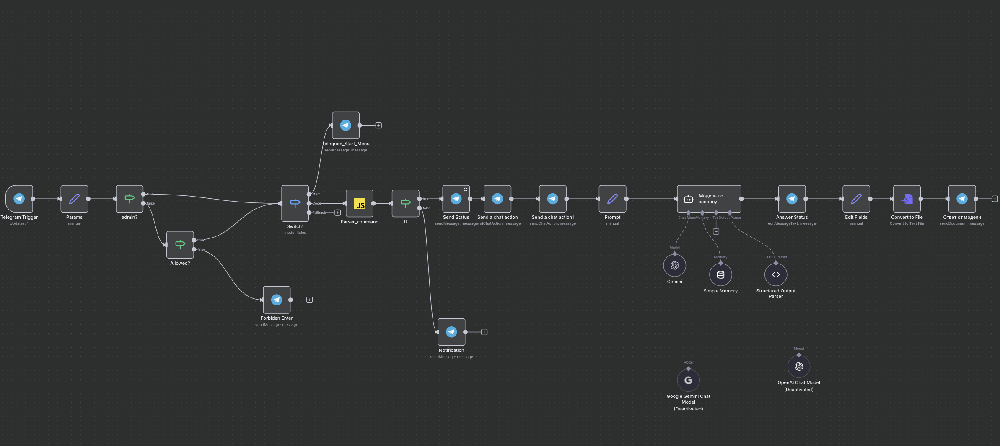

# 📚 Инструкция по использованию CodeLowBot

## 📖 Описание

**CodeLowBot** — это Telegram-бот, созданный на платформе n8n, который помогает пользователям изучать основы программирования на языке C. Бот использует AI-модель Google Gemini 2.5 Flash для генерации ответов и имеет встроенную систему памяти для поддержания контекста беседы.

---

## 🚀 Основные возможности

- ✅ Помощь в изучении основ программирования на языке C
- ✅ Ответы на вопросы по программированию
- ✅ Создание примеров кода с пояснениями
- ✅ Сохранение контекста беседы (память на 25 сообщений)
- ✅ Отправка кода в виде текстового файла
- ✅ Контроль доступа (только для разрешенных пользователей)

---

## 🎯 Команды бота

### `/start`
Запуск бота и отображение приветственного сообщения.

**Ответ бота:**
```
Привет 👋 Я помогу тебе с азами программирования на языке С

Напишите ваш запрос после команды "/code + text"
```

### `/code [ваш запрос]`
Основная команда для взаимодействия с ботом.

**Формат использования:**
```
/code напиши программу для вычисления факториала
```

---

## 📋 Как использовать бота

### Шаг 1: Запуск бота
1. Найдите бота в Telegram
2. Отправьте команду `/start`
3. Получите приветственное сообщение

### Шаг 2: Отправка запроса
1. Напишите `/code` и через пробел ваш вопрос или задание
2. Бот отправит статус "⏳ Дай подумаю..."
3. Дождитесь ответа бота

### Шаг 3: Получение ответа
Бот отправит вам:
1. **Сообщение с результатом:**
   ```
   ✅ Готово
   
   [Название программы]
   
   [Комментарии и пояснения]
   ```

2. **Файл с кодом:** текстовый файл `.txt` с готовым кодом

---

## 💡 Примеры использования

### Пример 1: Запрос простой программы
```
/code напиши программу Hello World на C
```

### Пример 2: Объяснение концепции
```
/code объясни что такое указатели в C
```

### Пример 3: Решение задачи
```
/code напиши программу для сортировки массива методом пузырька
```

### Пример 4: Помощь с ошибками
```
/code почему возникает ошибка segmentation fault
```

---

## ⚙️ Техническая архитектура

### Компоненты workflow:

1. **Telegram Trigger** — прием сообщений от пользователей
2. **Params** — извлечение параметров из сообщения
3. **admin?** — проверка, является ли пользователь администратором
4. **Allowed?** — проверка доступа пользователя к боту
5. **Switch1** — маршрутизация команд (`/start` или `/code`)
6. **Parser_command** — парсинг команды `/code` и извлечение текста запроса
7. **If** — проверка наличия текста в запросе
8. **Send Status** — отправка статуса "⏳ Дай подумаю..."
9. **Send a chat action** — отправка действия "typing"
10. **Prompt** — формирование запроса к AI-модели
11. **Модель по запросу** — AI Agent с использованием Gemini 2.5 Flash
12. **Simple Memory** — буферная память для хранения контекста (25 сообщений)
13. **Structured Output Parser** — парсинг структурированного ответа AI
14. **Answer Status** — обновление статусного сообщения с результатом
15. **Edit Fields** — подготовка данных для файла
16. **Convert to File** — конвертация кода в текстовый файл
17. **Ответ от модели** — отправка файла пользователю



### AI-модель:
- **Google Gemini 2.5 Flash** (`models/gemini-2.5-flash`)
- Память: буфер окна на 25 контекстных сообщений
- Session ID: привязка к ID чата пользователя

---

## 🔐 Система контроля доступа

### Уровни доступа:

1. **Администраторы** — полный доступ ко всем функциям
2. **Разрешенные пользователи** — доступ к основным функциям
3. **Неавторизованные пользователи** — доступ запрещен

### Сообщение при отсутствии доступа:
```
К сожалению у вас нет доступа к этому боту!
Обратитесь к администратору!
```

---

## 📝 Формат ответа AI

Бот генерирует ответ в структурированном формате:

```json
{
  "title": "Название программы/решения",
  "code": "Исходный код программы",
  "comments": "Пояснения и комментарии к коду"
}
```

Этот формат обеспечивается с помощью **Structured Output Parser**.

---

## 🎨 Промпт для AI-модели

Бот использует следующий системный промпт для генерации ответов:

```
Ты — помощник по программированию на языке C. Твоя задача — помогать 
пользователям изучать основы программирования, отвечать на вопросы, 
создавать примеры кода и давать понятные объяснения.

Всегда:
- Пиши чистый и понятный код
- Добавляй комментарии в коде
- Объясняй сложные концепции простыми словами
- Приводи практические примеры
- Следуй лучшим практикам программирования на C
```

---

## 🛠️ Технические детали

### Используемые инструменты n8n:
- **Telegram Nodes** — взаимодействие с Telegram API
- **LangChain Nodes** — работа с AI-моделями
- **Parser Nodes** — обработка команд
- **Code Nodes** — обработка данных
- **Memory Nodes** — хранение контекста

### Интеграции:
- Telegram Bot API
- Google Gemini API (через OpenAI-совместимый endpoint)
- n8n Workflow Engine

---

## ⚠️ Ограничения

1. Бот специализируется только на языке программирования **C**
2. Контекст беседы ограничен **25 последними сообщениями**
3. Доступ к боту требует **предварительной авторизации**
4. Бот работает только с командой `/code` для генерации ответов

---

## 📞 Поддержка

Если у вас возникли проблемы с доступом к боту, обратитесь к администратору.

При технических вопросах проверьте:
- ✅ Правильность формата команды `/code [текст]`
- ✅ Наличие у вас доступа к боту
- ✅ Работоспособность Telegram

---

## 🔄 История обновлений

### Текущая версия
- ✅ Интеграция с Google Gemini 2.5 Flash
- ✅ Система памяти для контекста беседы
- ✅ Структурированный вывод ответов
- ✅ Отправка кода в виде файлов
- ✅ Контроль доступа пользователей

---

**Разработано на платформе n8n**  
**AI-модель: Google Gemini 2.5 Flash**  
**Версия workflow: v1**