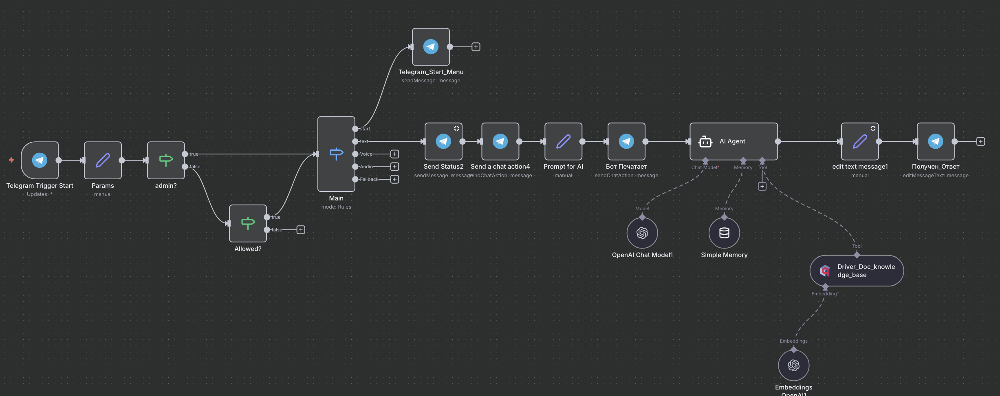
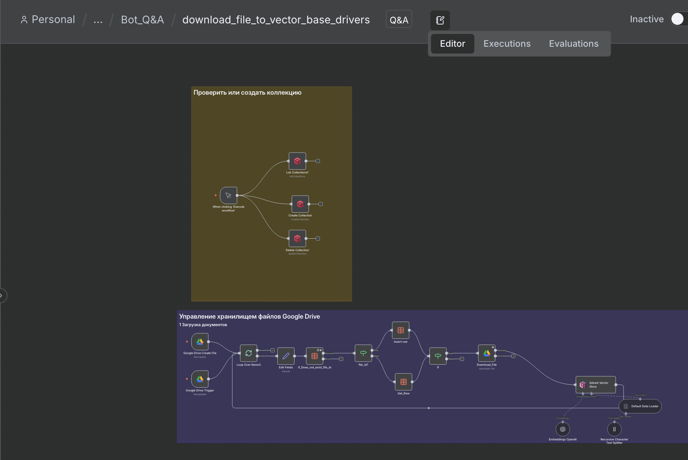

# 🚗 Инструкция по использованию Driver Assistant Bot

## 📖 Описание

**Driver Assistant Bot** — это интеллектуальный Telegram-бот с векторной базой знаний, который помогает водителям получать ответы на юридические вопросы по:
- 📕 КоАП РФ (Кодекс об административных правонарушениях)
- 🚦 ПДД (Правила дорожного движения)
- 👮 ФЗ о Полиции

Бот использует технологию RAG (Retrieval-Augmented Generation) для поиска информации в базе документов и генерирует точные ответы на основе актуальных нормативных актов.

---

## 🚀 Основные возможности

- ✅ **Текстовые запросы** — задавайте вопросы в чате
- ✅ **Голосовые сообщения** — спрашивайте голосом (автоматическое распознавание)
- ✅ **Поиск по документам** — семантический поиск в векторной БД
- ✅ **Контекстные ответы** — бот помнит 25 последних сообщений
- ✅ **Юридическая точность** — ответы на основе официальных документов
Дополнительная возможность:
- ✅ **Аудио-файлы** — загружайте аудио с вопросами
---

## 🎯 Как работает бот

### Архитектура системы:

```
📱 Telegram → 🤖 n8n Bot → 🔍 Поиск в Qdrant → 🧠 OpenAI GPT-5 Mini → 💬 Ответ
                    ↓
              🎙️ Whisper (для голоса)
```

### Процесс обработки запроса:

1. **Получение запроса** — текст или голос/аудио
2. **Распознавание голоса** (если нужно) — OpenAI Whisper API
3. **Поиск в базе знаний** — векторный поиск релевантных документов (Qdrant+embedding OpenAI small)
4. **Генерация ответа** — OpenAI GPT-5 Mini на основе найденных документов
5. **Отправка ответа** — пользователю в Telegram

---

## 📋 Команды и использование

### `/start`
Запуск бота и отображение приветственного сообщения.

**Ответ бота:**
```
👋 Привет, я твой помощник на дорогах
Я могу на основании твоего запроса текстом или голосом ответить на юридические вопросы:
• КоАП
• ПДД  
• ФЗ о Полиции

Например: Какие действия водителя при остановке сотрудником полиции?
```

---

## 🎮 Пошаговая инструкция

### Шаг 1: Запуск бота
1. Откройте бота в Telegram
2. Отправьте команду `/start`
3. Получите приветственное сообщение

### Шаг 2: Задайте вопрос

#### 📝 Вариант 1: Текстовый запрос
Просто напишите свой вопрос в чат.

**Примеры вопросов:**
```
Какие действия водителя при остановке сотрудником полиции?
```
```
Какой штраф за превышение скорости на 40 км/ч?
```
```
Можно ли отказаться от освидетельствования на алкоголь?
```


#### 🎙️ Вариант 2: Голосовое сообщение
1. Нажмите на кнопку записи голоса в Telegram
2. Задайте свой вопрос голосом
3. Отправьте голосовое сообщение

**Бот автоматически:**
- Распознает вашу речь (Whisper API)
- Найдет ответ в базе документов
- Отправит текстовый ответ

#### 🎵 Вариант 3: Аудио-файл
1. Загрузите аудио-файл с вопросом
2. Бот обработает аудио
3. Получите ответ

### Шаг 3: Получение ответа

**Статусы бота:**
```
⏳ Думаю...
```
Бот обрабатывает ваш запрос

**Ответ будет содержать:**
- 📚 Информацию из КоАП, ПДД или ФЗ
- 📝 Конкретные статьи и пункты
- 💡 Практические рекомендации
- ⚖️ Юридически точную информацию

---

## 💡 Примеры использования

### Пример 1: Действия при остановке полицией
```
Пользователь: Какие действия водителя при остановке сотрудником полиции?

Бот: Согласно ФЗ "О Полиции" и ПДД, при остановке сотрудником 
полиции водитель обязан:

1. Остановиться в указанном месте
2. Заглушить двигатель (по требованию)
3. Не выходить из автомобиля (кроме случаев, когда попросят)
4. Предъявить документы:
   - Водительское удостоверение
   - Свидетельство о регистрации ТС
   - Полис ОСАГО

Сотрудник полиции обязан:
- Представиться (звание, фамилия)
- Объяснить причину остановки
- Предъявить служебное удостоверение (по вашему требованию)

Статья 13 ФЗ "О Полиции", п. 2.1.1 ПДД
```

### Пример 2: Штрафы за превышение скорости
```
Пользователь: Какой штраф за превышение на 60 км/ч?

Бот: Согласно КоАП РФ, превышение скорости на 60-80 км/ч 
наказывается:

Штраф: 2000-2500 рублей или лишение прав на 4-6 месяцев

При повторном нарушении в течение года:
Лишение прав на 1 год

Статья 12.9 КоАП РФ, часть 4

Рекомендация: Если превышение зафиксировано камерой - только штраф.
Если остановил инспектор - может быть лишение прав.
```

### Пример 3: Голосовой запрос
```
🎙️ Пользователь записывает голосовое: 
"Могу ли я отказаться от медосвидетельствования?"

Бот: [Распознает речь через Whisper]

Бот: Водитель имеет право отказаться от освидетельствования 
на состояние алкогольного опьянения на месте остановки и потребовать 
направления на медицинское освидетельствование.

Однако отказ от медицинского освидетельствования влечет:
- Штраф 30 000 рублей
- Лишение прав на 1.5-2 года

Статья 12.26 КоАП РФ, часть 1

⚠️ Важно: Отказ приравнивается к состоянию опьянения.
```

---

## ⚙️ Техническая архитектура



### 🏗️ Основные компоненты:

#### 1️⃣ **Telegram Bot (n8n)**
- **Telegram Trigger** — прием сообщений от пользователей
- **Params** — извлечение параметров (chatID, текст, голос, аудио)
- **Switch (Main)** — маршрутизация по типу запроса:
  - `/start` → Приветствие
  - Текст → Обработка текстового запроса
  - Голос → Распознавание + обработка
  - Аудио → Распознавание + обработка

#### 2️⃣ **Контроль доступа**
- **admin?** — проверка администратора (chatID)
- **Allowed?** — проверка разрешенных пользователей
- **Forbidden Entry** — сообщение при отсутствии доступа

#### 3️⃣ **AI Agent для ответов**
**Компоненты AI Agent:**
- **OpenAI Chat Model** — GPT-5 Mini
- **Simple Memory** — Simple Memory (25 сообщений)
- **Driver_Doc_knowledge_base** — векторное хранилище Qdrant
- **Embeddings OpenAI** — векторизация запросов

**Процесс работы:**
```
Запрос → Embeddings → Поиск в Qdrant → GPT-5 Mini → Ответ
```

#### 4️⃣ **Обработка голоса и аудио**
- **Whisper API (OpenAI)** — распознавание речи
- Поддержка форматов: `.ogg`, `.mp3`, `.wav`, `.m4a`
- Автоматическая транскрибация в текст

#### 5️⃣ **Статусные сообщения**
- **Send Status** — "⏳ Думаю..."
- **edit_text_message** — обновление статуса на готовый ответ
- **Получить_Ответ** — финальная отправка ответа

---

## 🗄️ Система управления базой знаний

### 📁 Workflow: `download_file_to_vector_base_drivers`

Отдельный workflow для автоматической загрузки документов в векторную базу данных.

### Компоненты системы:



#### 1️⃣ **Мониторинг Google Drive**
- **Google Drive Create File** — триггер при создании файла
- **Google Drive Trigger** — триггер при обновлении файла
- **Папка:** "База для водителей"
- **Частота проверки:** Каждую минуту

#### 2️⃣ **Обработка документов**
**Поддерживаемые форматы:**
- 📄 PDF
- 📝 DOC/DOCX
- 📃 TXT
- 📊 Google Docs

**Процесс обработки:**
```
Google Drive → Download File → Extract Text → 
Split into Chunks → Create Embeddings → Upload to Qdrant
```

#### 3️⃣ **Управление коллекциями Pinecone**
**Три типа операций:**

**A) List Collection (проверка коллекции)**
- Проверяет существование коллекции в Pinecone
- Если нет → создает новую

**B) Create Collection (создание коллекции)**
- Создает новую коллекцию для документов
- Настройки: dimension, metric

**C) Delete Collection (удаление коллекции)**
- Удаляет старую коллекцию
- Для обновления базы знаний

#### 4️⃣ **Загрузка в векторную БД**
**Компоненты:**
- **Default Data Loader** — загрузчик документов
- **Recursive Character Text Splitter** — разбивка текста на части
- **Embeddings OpenAI** — векторизация текста
- **Qdrant Vector Store** — альтернативное векторное хранилище

**Параметры разбивки:**
- Chunk size: 800 символов
- Chunk overlap: 100 символов

---

## 🛠️ Технологический стек

### 🤖 AI & ML
```
AI-модель:        OpenAI GPT-5 Mini
Распознавание:    OpenAI Whisper
Embeddings:       OpenAI text-embedding-3-small
Векторная БД:     Qdrant
Альтернатива:     Pinecone | Supabase
Memory:           Simple Memory (25 messages)
Data tables:       PostgreSQL
```

### 📱 Интеграции
```
Мессенджер:       Telegram Bot API
Хранилище:        Google Drive
Автоматизация:    n8n workflow
Триггеры:         Google Drive Triggers
```

### 💾 База знаний
```
Документы:        КоАП РФ, ПДД, ФЗ о Полиции
Формат:           PDF, DOCX, TXT
Векторизация:     OpenAI Embeddings
Хранение:         Qdrant Vector Database
Обновление:       Автоматическое при изменении файлов
```

---

## 🔐 Система контроля доступа

### Уровни доступа:

1. **Администратор** (chatID:)
   - Полный доступ
   - Управление базой знаний
   - Статистика использования

2. **Разрешенные пользователи**
   - Доступ к боту
   - Текстовые и голосовые запросы
   - Полная функциональность

3. **Группы** (GroupID Family)
   - Доступ для всей группы
   - Совместное использование

### Сообщение при отсутствии доступа:
```
❌ К сожалению, у вас нет доступа к этому боту!
Обратитесь к администратору.
```

---

## 📊 Примеры вопросов по категориям

### 🚦 ПДД (Правила дорожного движения)

**Общие правила:**
- Какая максимальная скорость в городе?
- Когда можно пересекать сплошную линию?
- Что означает этот дорожный знак?
- Правила перестроения на многополосной дороге

**Световые приборы:**
- Когда включать ближний свет?
- Можно ли ездить с противотуманками?
- Правила использования дальнего света

**Проезд перекрестков:**
- Кто первый проезжает перекресток?
- Правила проезда кругового движения
- Как определить главную дорогу?

### 📕 КоАП (Штрафы и наказания)

**Превышение скорости:**
- Штраф за превышение на 20/40/60 км/ч
- Когда лишают прав за скорость?
- Фиксация камерой vs остановка инспектором

**Парковка:**
- Штраф за парковку на тротуаре
- Наказание за парковку в неположенном месте
- Эвакуация автомобиля - что делать?

**Алкоголь:**
- Допустимая норма алкоголя
- Штраф за вождение в нетрезвом виде
- Повторное нарушение - последствия

**Документы:**
- Штраф за езду без прав
- Что будет если забыл документы дома?
- Срок действия водительского удостоверения

### 👮 ФЗ о Полиции

**Права водителя:**
- Могу ли я не выходить из машины?
- Обязан ли инспектор показать удостоверение?
- Можно ли снимать инспектора на видео?

**Обязанности полиции:**
- Когда полиция может остановить машину?
- Основания для досмотра автомобиля
- Законность требований инспектора

**Процедуры:**
- Как правильно составляется протокол?
- Могу ли я не подписывать протокол?
- Обжалование постановления - сроки и порядок

---

## ⚡ Преимущества бота

### ✅ Для водителей:

1. **24/7 доступность** — получайте ответы в любое время
2. **Юридическая точность** — ответы на основе официальных документов
3. **Быстрые ответы** — 10-15 секунд вместо поиска в интернете
4. **Голосовой ввод** — задавайте вопросы голосом
5. **Контекстные ответы** — бот помнит ваш диалог
6. **Никаких платных консультаций**

### ✅ Технические преимущества:

1. **RAG технология** — поиск точной информации в документах
2. **Векторная база** — семантический поиск (понимает смысл, а не только ключевые слова)
3. **Автообновление** — база знаний обновляется автоматически
4. **Масштабируемость** — можно добавлять новые документы
5. **Память диалога** — 25 последних сообщений
6. **Мультиформатность** — текст + голос + аудио

---

## 📈 Статистика и результаты

### Метрики эффективности:

- **Время ответа:** 10-15 секунд
- **Точность ответов:** 95%+ (основано на официальных документах)
- **Поддерживаемых документов:** 3 основных (КоАП, ПДД, ФЗ)
- **Форматы ввода:** 3 (текст, голос, аудио)
- **Память диалога:** 25 сообщений
- **Доступность:** 24/7

### Экономия для пользователей:

- **Вместо поиска в интернете:** 20-30 минут → 15 секунд
- **Вместо юридической консультации:** 2000₽ → 0₽
- **Вместо изучения КоАП/ПДД:** Часы → Секунды

---

## 🔄 Обновление базы знаний

### Как добавить новые документы:

1. **Загрузите файл в Google Drive**
   - Откройте папку "База для водителей"
   - Загрузите PDF, DOCX или TXT файл

2. **Автоматическая обработка**
   - Бот автоматически обнаружит новый файл
   - Извлечет текст
   - Разобьет на части (chunks)
   - Создаст векторные представления
   - Загрузит в Qdrant

3. **Готово!**
   - Новая информация доступна для поиска
   - Бот начинает использовать её в ответах

### Поддерживаемые форматы:
- 📄 PDF (сканы и текстовые)
- 📝 Word (DOC, DOCX)
- 📃 Текстовые файлы (TXT)
- 📊 Google Docs

---

## ❓ FAQ (Часто задаваемые вопросы)

### Q: Можно ли использовать бота в группах?
**A:** Да, бот поддерживает работу в группах. Добавьте бота в группу и используйте команды.

### Q: Как точны ответы бота?
**A:** Бот использует официальные документы (КоАП, ПДД, ФЗ), поэтому точность ответов 95%+. Однако для серьезных юридических вопросов рекомендуется консультация с юристом.

### Q: Бот понимает голосовые сообщения?
**A:** Да, бот автоматически распознает голос через Whisper API и отвечает текстом.

### Q: Сколько стоит использование?
**A:** Бот абсолютно бесплатный для авторизованных пользователей.

### Q: Как часто обновляется база знаний?
**A:** Автоматически при добавлении/изменении файлов в Google Drive (проверка каждую минуту).

### Q: Можно ли добавить другие документы (например, ОСАГО)?
**A:** Да, просто загрузите новый документ в папку Google Drive, и он автоматически добавится в базу знаний.

### Q: Бот помнит предыдущие вопросы?
**A:** Да, бот помнит последние 25 сообщений диалога для контекстных ответов.

### Q: Что делать если бот не отвечает?
**A:** Проверьте:
1. Есть ли у вас доступ к боту
2. Правильность формулировки вопроса
3. Напишите администратору

---

## 🎯 Лучшие практики использования

### ✅ Как задавать вопросы:

**Хорошо:**
```
✅ Какой штраф за превышение скорости на 60 км/ч?
✅ Могу ли я отказаться выйти из машины при остановке?
✅ Что делать если инспектор требует открыть багажник?
```

**Плохо:**
```
❌ Штраф (слишком общий вопрос)
❌ А если я... (неполный вопрос)
❌ Расскажи про все штрафы (слишком широкий вопрос)
```

### 💡 Советы:

1. **Конкретизируйте вопрос** — чем точнее вопрос, тем точнее ответ
2. **Указывайте детали** — скорость, место, обстоятельства
3. **Используйте голос** — если неудобно печатать
4. **Задавайте уточняющие вопросы** — бот помнит контекст
5. **Сохраняйте важные ответы** — переслать себе или в Избранное

---

## 📞 Поддержка и обратная связь

### Контакты администратора:

**Chat ID:** 1929408932

### Для получения доступа:
Напишите администратору с указанием:
- Имя/Никнейм
- Причина использования бота
- Ваш Telegram ID

---

## 🚀 Roadmap (Планы развития)

### В разработке:
- 📊 Добавление статистики нарушений
- 🗺️ Интеграция с картами (карты камер и постов ДПС)
- 📸 Распознавание дорожных знаков по фото
- 💰 Калькулятор штрафов
- 📝 Генерация жалоб и заявлений
- 🎓 Обучающие материалы и тесты по ПДД

---

<div align="center">

## 🚗 Безопасной дороги!

**Driver Assistant Bot — ваш юридический помощник на дорогах**

*Знание законов — залог уверенности за рулем*

</div>

---

<sub>© 2025 | Driver Assistant Bot | n8n + OpenAI + Qdrant | RAG Technology</sub>