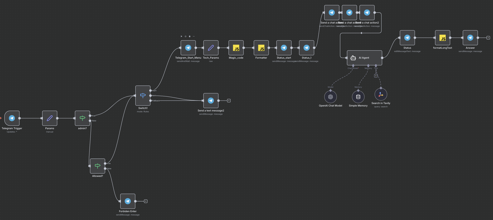

# 🚜 Victor Engineer Bot - Документация

## 📋 Описание проекта

**Victor Engineer Bot** — это Telegram-бот для инженерных расчетов параметров вездеходов и внедорожной техники. Бот собирает технические данные о транспортном средстве через интерактивную форму и выполняет автоматические расчеты с использованием AI-агента на базе OpenAI.

### Основные возможности

- ✅ Сбор технических параметров транспортного средства через удобную форму
- ✅ Автоматические инженерные расчеты на основе введенных данных
- ✅ AI-ассистент для детального анализа и рекомендаций
- ✅ Система контроля доступа (администратор + белый список)
- ✅ Интеграция с поисковой системой Tavily для актуальной информации

---

## 🏗️ Архитектура бота

### Общая схема работы

```
Telegram Trigger → Проверка доступа → Switch (команды) → Форма ввода → 
→ Обработка данных → AI Agent → Форматирование → Отправка результата
```

### Основные узлы workflow

1. **Telegram Trigger** - точка входа, получает сообщения от пользователей
2. **Params** - извлекает и сохраняет параметры (текст, chatID, список разрешенных пользователей)
3. **admin?** - проверка на права администратора
4. **Allowed?** - проверка наличия пользователя в белом списке
5. **Switch1** - маршрутизация по командам (/start или обычный текст)
6. **Telegram_Start_Menu** - приветствие и форма для сбора данных
7. **Tech_Params** - обработка ответов формы
8. **Magic_code** - JavaScript-код для расчетов
9. **Formatter** - форматирование результатов
10. **AI Agent** - анализ данных с помощью OpenAI
11. **Answer** - отправка финального ответа пользователю


---

## 🔐 Система контроля доступа

### Типы пользователей

1. **Администратор** (AdminChatID)
   - Полный доступ ко всем функциям
   - Обход проверки белого списка

2. **Разрешенные пользователи** (Whitelist):
 
3. **Неавторизованные пользователи**
   - Получают сообщение: "👉 Спроси разрешение - обратитесь к администратору"

### Как добавить нового пользователя

В узле **Params** добавьте новую запись в assignments:
```json
{
  "id": "новый-uuid",
  "name": "имя_пользователя",
  "value": "telegram_chat_id",
  "type": "string"
}
```

Затем обновите условие в узле **Allowed?**, добавив проверку нового пользователя.

---

## 📝 Форма сбора данных

### Поля формы

| № | Название поля | Тип | Обязательность | Описание |
|---|--------------|------|----------------|----------|
| 1 | 🚜 Название Звездной тачки | text | нет | Название транспортного средства |
| 2 | Тип Двигателя | dropdown | нет | Дизельный / Бензиновый / Электрический |
| 3 | Крутящий момент двигателя, Нм | number | да | В ньютон-метрах (Нм) |
| 4 | Обороты двигателя, об/мин | number | да | Обороты в минуту |
| 5 | Максимальная мощность, кВт | number | да | Мощность в киловаттах |
| 6 | Высшая передача раздаточной коробки | number | да | Передаточное число |
| 7 | Низшая передача раздаточной коробки | number | да | Передаточное число |
| 8 | Передаточное число главной передачи | number | да | Передаточное число |
| 9 | Размер колеса | text | да | Формат: 205/65R15 (R от 10 до 26) |
| 10 | КПД трансмиссии | number | да | Коэффициент полезного действия |
| 11 | Масса транспортного средства, кг | number | да | Общая масса в килограммах |
| 12 | Ведущие колеса, кол-во | number | да | Количество ведущих колес |
| 13 | Передаточные числа КПП | text | да | Через запятую, например: 5.1, 4.5, 1.0, 0.8 |
| 14 | Вид дороги | dropdown | да | 🛣️ Асфальт / 🌾 Грунт / 🌳 Лес / 🌧️ Грязь / ❄️ Снег / 🏖️ Песок / 🧊 Лёд |

---

## ⚙️ Технические детали

### Используемые технологии

- **Платформа**: n8n (автоматизация workflow)
- **Мессенджер**: Telegram Bot API
- **AI**: OpenAI Chat Model (gpt-4 или gpt-3.5-turbo)
- **Поиск**: Tavily Search API
- **Язык программирования**: JavaScript (для расчетных узлов)

### Узлы обработки данных

#### Magic_code (JavaScript)
Выполняет инженерные расчеты на основе введенных пользователем данных. Обрабатывает параметры двигателя, трансмиссии и колес.

#### Formatter (JavaScript)
Форматирует результаты расчетов в читаемый вид для передачи в AI Agent.

#### AI Agent (OpenAI)
- Модель: OpenAI Chat Model
- Память: Simple Memory (сохраняет контекст разговора)
- Инструмент: Search in Tavily (поиск актуальной информации)
- Задача: анализ данных, предоставление рекомендаций, ответы на вопросы

#### formatLongText (Code)
Обрабатывает длинные ответы от AI, разбивает их на части при необходимости для отправки в Telegram (ограничение на длину сообщения).

---

## 🚀 Установка и настройка

### Предварительные требования

1. Установленный n8n
2. Telegram Bot Token (получить у [@BotFather](https://t.me/botfather))
3. OpenAI API Key
4. Tavily API Key (опционально)

### Шаги установки

1. **Импорт workflow**
   ```bash
   # В n8n: Workflows → Import from File
   # Выбрать файл: engineer.json
   ```

2. **Настройка credentials**

   #### Telegram API
   - Название: `Engineer_IVAN`
   - Bot Token: получите от @BotFather
   - Установите webhook для триггера

   #### OpenAI API
   - API Key: из аккаунта OpenAI
   - Модель: gpt-4 или gpt-5

   #### Tavily Search (опционально)
   - API Key: из аккаунта Tavily

3. **Настройка доступов**
   
   В узле **Params** укажите:
   - `AdminChatID` - ваш Telegram Chat ID
   - Добавьте разрешенных пользователей (см. раздел "Как добавить нового пользователя")

4. **Активация workflow**
   ```
   Переключите статус workflow на "Active"
   ```

---

## 💬 Использование бота

### Команды

- `/start` - запуск бота, отображение приветствия и формы

### Сценарий работы

1. Пользователь отправляет команду `/start`
2. Бот проверяет права доступа
3. Если доступ разрешен, показывается приветственное сообщение:
   ```
   👋 Привет, я Виктор - кудесник инженерной мысли, проектирую вездеходы
   Я могу на основании твоего запроса текста 
   - Произвести расчеты на основании твоих данных
   Заполни форму - Поехали 💬.
   ```
4. Пользователь нажимает кнопку "👉 Тык сюда"
5. Открывается форма "Параметры узлов" с 14 полями
6. Пользователь заполняет форму и нажимает "🧮 Рассчитать"
7. Бот выполняет расчеты и анализ через AI
8. Результаты отправляются пользователю

### Пример взаимодействия

```
Пользователь: /start

Бот: 👋 Привет, я Виктор - кудесник инженерной мысли...
[Кнопка: 👉 Тык сюда]

Пользователь: [Заполняет форму]
- Название: Внедорожник УАЗ
- Тип двигателя: Дизельный
- Крутящий момент: 235 Нм
- Обороты: 4200 об/мин
...

Бот: [Typing...]
[Результаты расчетов и рекомендации от AI]
```

---

## 🔧 Настройка и кастомизация

### Изменение приветственного сообщения

В узле **Telegram_Start_Menu** измените параметр `message`:
```json
"message": "Ваше новое приветствие"
```

### Добавление новых полей в форму

В узле **Telegram_Start_Menu**, в секции `formFields.values` добавьте:
```json
{
  "fieldLabel": "Название поля",
  "fieldType": "text", // text, number, dropdown
  "placeholder": "Подсказка",
  "requiredField": true
}
```

### Изменение логики расчетов

Отредактируйте код в узле **Magic_code** (JavaScript):
```javascript
// Добавьте свои формулы расчетов
const yourCalculation = ...;
return { json: { result: yourCalculation } };
```

### Настройка AI-агента

В узле **AI Agent** можно изменить:
- System prompt (системные инструкции)
- Температуру генерации (creativity)
- Максимальное количество итераций

---

## 📊 Мониторинг и отладка

### Просмотр логов выполнения

1. В n8n перейдите в раздел **Executions**
2. Выберите интересующий запуск
3. Изучите прохождение данных через узлы

### Типичные ошибки и решения

| Ошибка | Причина | Решение |
|--------|---------|---------|
| "Webhook not found" | Не настроен Telegram webhook | Пересохраните Telegram Trigger |
| "OpenAI API error" | Неверный API key или лимит | Проверьте credentials OpenAI |
| Бот не отвечает | Workflow неактивен | Активируйте workflow |
| "Forbidden" в Telegram | Неверный Bot Token | Проверьте Telegram credentials |

### Режим отладки

Для тестирования без Telegram:
1. Используйте узел **Manual Trigger** вместо Telegram Trigger
2. Добавьте узел **Set** с тестовыми данными
3. Запустите workflow вручную

---

## 🔒 Безопасность

### Рекомендации

- ✅ Храните API ключи в credentials, не в коде
- ✅ Регулярно обновляйте список разрешенных пользователей
- ✅ Используйте HTTPS для webhook
- ✅ Ограничьте права бота в Telegram (отключите группы, если не нужны)
- ✅ Мониторьте количество запросов к API

### Защита от спама

В workflow есть встроенная защита:
- Проверка прав доступа (admin + whitelist)
- Сообщение для неавторизованных пользователей
- Валидация обязательных полей формы

---

## 📈 Масштабирование

### Добавление новых функций

Возможные расширения:
- Сохранение истории расчетов в базу данных
- Экспорт результатов в PDF/Excel
- Визуализация графиков (тяговые характеристики)
- Многоязычность
- Интеграция с CAD-системами

### Производительность

- n8n может обрабатывать несколько запросов параллельно
- OpenAI имеет лимиты по количеству запросов в минуту
- Рекомендуется настроить rate limiting при большом количестве пользователей

---

## 🆘 Поддержка и контакты

### Получение помощи

- Документация n8n: [docs.n8n.io](https://docs.n8n.io)
- Telegram Bot API: [core.telegram.org/bots](https://core.telegram.org/bots)
- OpenAI API: [platform.openai.com/docs](https://platform.openai.com/docs)

### Обратная связь

Для сообщений об ошибках или предложений:
- Свяжитесь с администратором бота
- Используйте функцию feedback в n8n

---

## 📄 Лицензия и авторские права

Данный проект является примером реализации Telegram-бота на n8n.
При использовании кода убедитесь, что у вас есть:
- Лицензия на использование n8n
- Действующие API ключи для всех сервисов
- Согласие на обработку персональных данных пользователей

---

## 🔄 История версий

### v3.0 (текущая)
- ✅ AI Agent с OpenAI
- ✅ Интеграция Tavily Search
- ✅ Расширенная форма (14 полей)
- ✅ Система контроля доступа
- ✅ Анимация статуса набора текста

### Будущие улучшения
- 🔜 База данных для истории расчетов
- 🔜 Экспорт результатов
- 🔜 Графики и визуализации
- 🔜 Мультиязычность

---

## 📚 Приложения

### Глоссарий терминов

- **n8n** - платформа для автоматизации workflow
- **Node** (узел) - отдельный элемент обработки данных в workflow
- **Webhook** - URL для приема входящих данных
- **Chat ID** - уникальный идентификатор чата в Telegram
- **Credentials** - учетные данные для доступа к внешним сервисам

### Полезные ресурсы

- [Калькулятор передаточных чисел](https://www.jeepforum.com/calculators/)
- [Инженерные формулы для вездеходов](https://www.off-road.ru/tech/)
- [Документация по трансмиссии](https://www.automobile-catalog.com/)

---

**Создано для инженеров-энтузиастов вездеходостроения! 🚜💨**