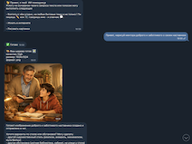
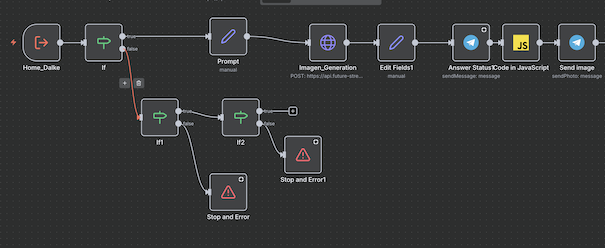
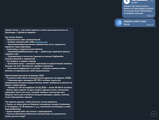
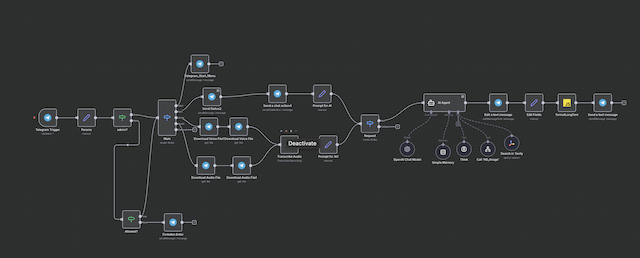

# **Home Bot** пример простого бота для домашнего пользования на платформе low-code | n8n |

## 🛠️ **Технологический стек**:
- 💻 **инфраструктура** | self-hosted | workflow n8n |
- 🤖 **ИИ** | OpenAI GPT 5 nano | Imagen 1.5 OpenAI | Trascribe audio |
- 📄 **База Данных** | Simple Memory |
- 📲 **Мессенджер**  | Telegram |
- 🌐 **WebSearch**   | Tavily

## ⛓️‍💥 **Сценарии и Взаимодействие**:

- ✋ **Приветствие** по команде /start 

- 🤖 **Бот** | Взаимодействие с пользователем по текстовым запросам | аудио | через запросы пользователя в Телеграм  
- 🎨 **Генерация картинок**  на основании короткой фразы  формирует промпт и генерирует изображение:

  

- Подпроцесс генарации изображения через HTTP POST запрос API OPENAI:

  

- 🧠 **Генерация текста**  на основании короткой вопросов текстом или аудио от пользователя - бот формирует ответы  и генерирует текст 

- Пример герерации текста на основании аудио запроса:

  

- 💻 **Инфраструктура**  n8n - главный процесс и ИИ Агент(оркестратор)

  

