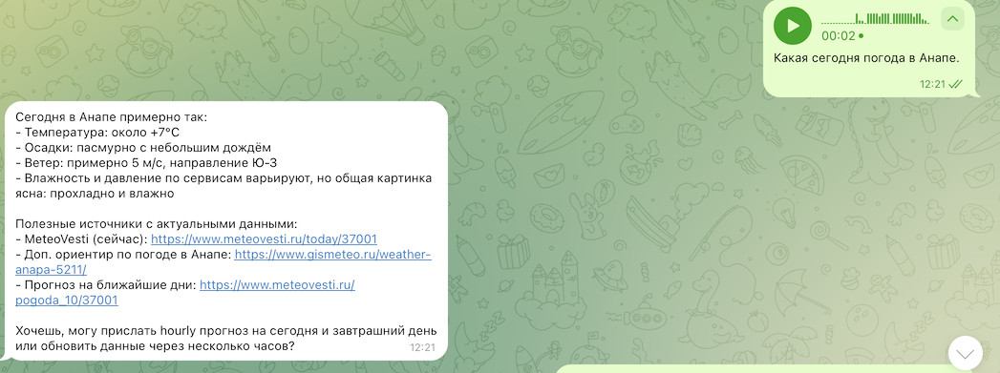

# **Home Bot** пример простого бота для домашнего пользования на платформе low-code | n8n |

## 🛠️ **Технологический стек**:
- 💻 **инфраструктура** | self-hosted | workflow n8n |
- 🤖 **ИИ** | OpenAI GPT 5 nano | Imagen 1.5 OpenAI | Trascribe audio |
- 📄 **База Данных** | Simple Memory |
- 📲 **Мессенджер**  | Telegram |
- 🌐 **WebSearch**   | Tavily

n8n - главный процесс ИИ Агент(оркестратор)
  Основной процесс ИИ агента:
  
  
  
  Подпроцесс генерации изображния:

   

## ⛓️‍💥 **Сценарии и Взаимодействие**:
### Структура  бота:

**Основной сценарий (оркестратор)**:
  - 27 различных нод 
  - ✋ **Приветствие** по команде /start запускаем бота
  - 🤖 **Бот** | Взаимодействие с пользователем по текстовым запросам | аудио | через запросы пользователя в Телеграм  
  - В боте предусмотрена защита от подключения от ненужных пользователей по chatID

  - 🧠 **Генерация текста**  на основании короткой вопросов текстом или аудио от пользователя - бот формирует ответы  и генерирует текст 

  - Пример герерации текста на основании аудио запроса:

    

  - 🌐 **Вебпоиск** на основании коротких вопросов текстом или аудио от пользователя осуществляет вебпоиск через tool Tavily  

    

**Подпроцесс генарации изображения** через HTTP POST запрос API OPENAI:

  - 🎨 **Генерация картинок**  на основании короткой фразы  ИИ Агент отправляет запрос на дополнительный workflow - формирует промпт и генерирует изображение:

    

📫 **Давайте работать вместе!** → 

