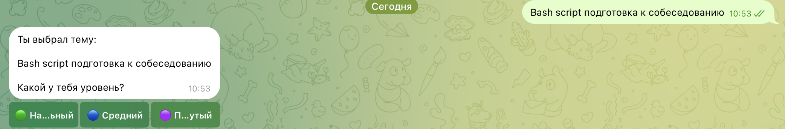
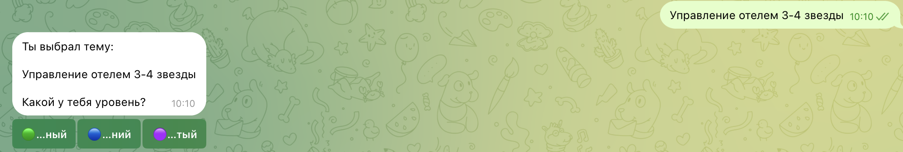
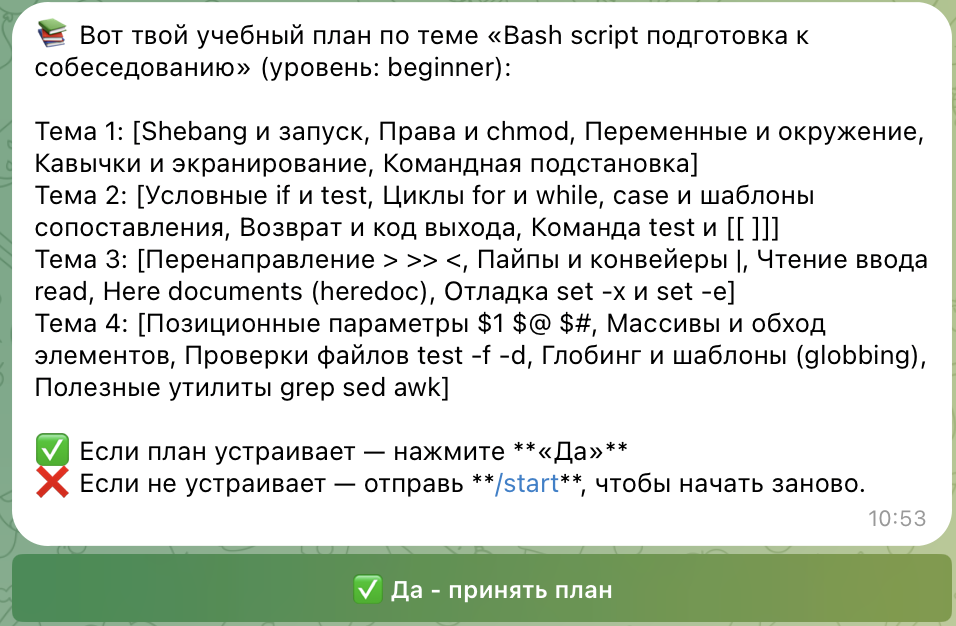
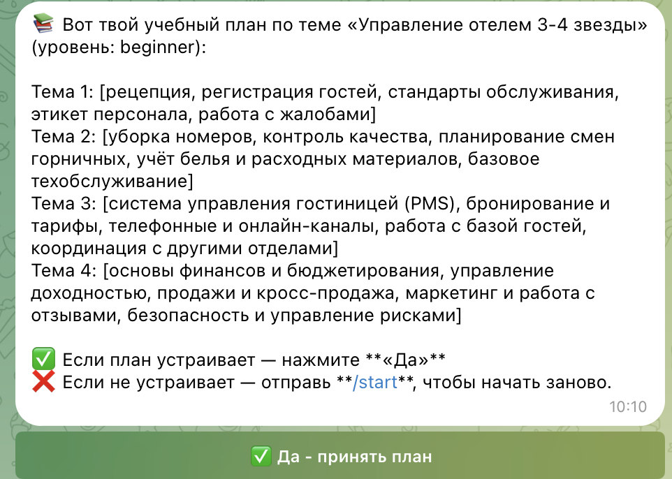
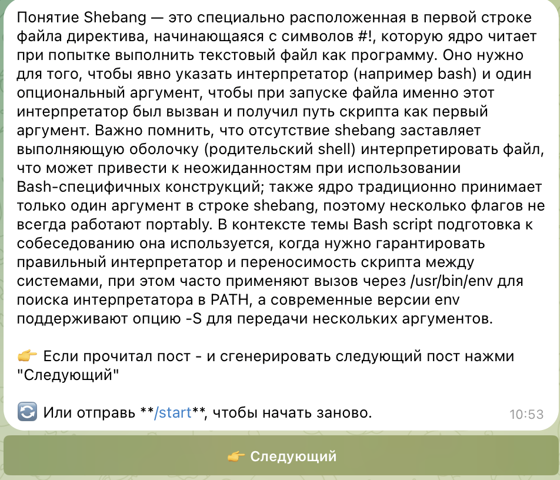
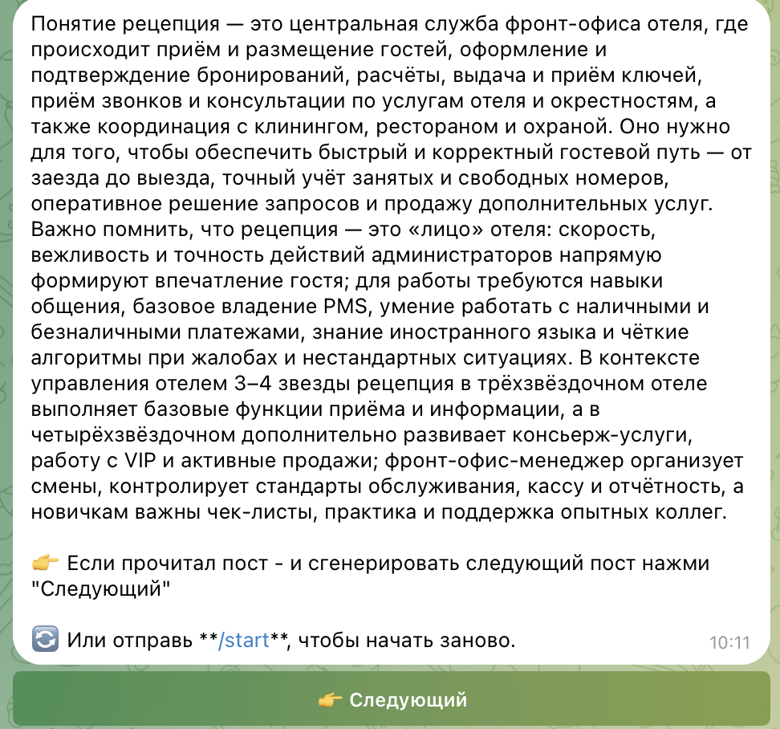
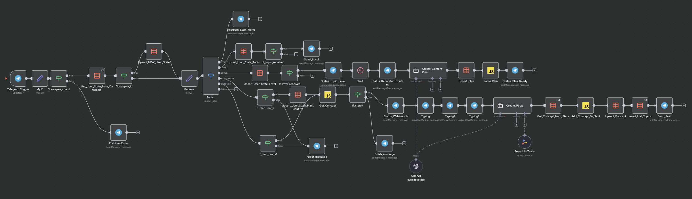

# 🎓 Инструкция по использованию Personal Mentor Bot

## 📖 Описание

**Personal Mentor Bot** — это интеллектуальный Telegram-бот на платформе n8n, который выступает в роли вашего персонального наставника по обучению. Бот создает индивидуальные учебные планы, генерирует образовательный контент и отправляет обучающие посты по выбранной теме с использованием AI (OpenAI) и поиска актуальной информации в интернете (Tavily Search).

---

## 🚀 Основные возможности

- ✅ Создание персонализированных учебных планов
- ✅ Генерация образовательного контента на основе AI
- ✅ Поиск актуальной информации в интернете
- ✅ Пошаговая отправка обучающих постов
- ✅ Адаптация под разные уровни подготовки (Junior, Middle, Senior)
- ✅ Хранение прогресса обучения в базе данных
- ✅ Контроль доступа пользователей

---

## 🎯 Как работает бот

### Этап 1: Выбор темы обучения 📝
Вы указываете, чему хотите научиться. Примеры тем:
 
**для ИТ**
- "Bash script подготовка к собеседованию"
- "Python для анализа данных"
- "Docker и контейнеризация"
- "Git и командная работа"

**Отельный сервис**
- "Управление персоналом"
- "Управление отелем"

**для HR**
- "Управление персоналом"
- "Мотивация"


### Этап 2: Указание уровня подготовки 📊
Бот предложит выбрать ваш текущий уровень:
- **Начальнй** — начальный уровень
- **Средний** — средний уровень
- **Продвинутый** — продвинутый уровень

### Этап 3: Генерация учебного плана 📋
Бот создаст индивидуальный план обучения с темами и концепциями, которые вам нужно изучить.

### Этап 4: Подтверждение плана ✅
Вы подтверждаете готовность начать обучение.

### Этап 5: Получение постов 📬
Бот начинает отправлять вам обучающие посты по каждой теме из плана с актуальной информацией из интернета.

---

## 📋 Команды и использование

### `/start`
Запуск бота и начало работы.

**Ответ бота:**
```
🤝 Привет! Я твой персональный ментор 🤖, который поможет составить для тебя 
учебный план и пришлёт посты 📝 с полезной информацией по желаемой теме.

Чему ты хочешь научиться?
👉 в рамках работы над текущим учебным проектом
👉 в рамках подготовки к собеседованию
👉 трудоустройству

Просто напиши Тему вот Пример: "Bash script подготовка к собеседованию"
```

---

## 🎮 Пошаговая инструкция по работе

### Шаг 1: Запуск бота
1. Откройте бота в Telegram
2. Отправьте команду `/start`
3. Дождитесь приветственного сообщения

### Шаг 2: Укажите тему обучения
**Формат:** Просто напишите название темы

**Примеры:**
```
Bash script подготовка к собеседованию
```
```
Управление отелем 3-4 звезды
```


**Статус:** Бот отобразит сообщение "⏳ Обрабатываю тему..."

### Шаг 3: Выберите уровень подготовки
Бот спросит ваш уровень подготовки:
```
🎯 Отлично! Тема получена.
Теперь укажи свой уровень подготовки:
```

Выберите один из вариантов:
- **🟢Начальный** 👶
- **🔵Средний** 🧑‍💻
- **🟣Продвинутый** 🚀

**Bash script подготовка к собеседованию**:

  

**Управление отелем 3-4 звезды**



### Шаг 4: Дождитесь генерации плана
**Статус бота:**
```
⏳ Подожди, создаю учебный план...
```
```
🔍 Генерирую контент...
```

Бот создаст индивидуальный учебный план на основе вашей темы и уровня.

### Шаг 5: Подтвердите план
После создания плана бот покажет его и попросит подтверждение:
```
✅ План готов!

[Содержание плана]

Начинаем обучение?
```
**Bash script подготовка к собеседованию**:

  

**Управление отелем 3-4 звезды**

  

Подтвердите согласие (обычно кнопкой или сообщением "Да" / "Начать")

### Шаг 6: Получайте посты
Бот начнет отправлять обучающие посты по каждой теме из плана:
```
📚 Пост 1/10: [Название концепции]

[Образовательный контент с актуальной информацией]
```

---

**Bash script подготовка к собеседованию**:

  

**Управление отелем 3-4 звезды**

  

## 💡 Примеры использования

### Пример 1: Подготовка к собеседованию по Bash
```
Пользователь: /start
Бот: 🤝 Привет! Я твой персональный ментор...

Пользователь: Bash scripting подготовка к собеседованию
Бот: ⏳ Обрабатываю тему...
Бот: 🎯 Отлично! Укажи свой уровень: Junior / Middle / Senior

Пользователь: Middle
Бот: ⏳ Создаю учебный план...
Бот: ✅ План готов! [План с 10 темами]

Пользователь: Начать
Бот: 📚 Пост 1/10: Основы работы с переменными в Bash...
```

### Пример 2: Управление отелем 3-4 звезды
```
Пользователь: Управление отелем 3-4 звезды для начинающих
Бот: 🎯 Отлично! Укажи свой уровень...
Пользователь: Начинающий
Бот: ⏳ Создаю план...
[Генерация плана из 8-12 тем для новичков]
```

---

### Пример 3: Изучение Docker
```
Пользователь: Docker и контейнеризация для начинающих
Бот: 🎯 Отлично! Укажи свой уровень...
Пользователь: Junior
Бот: ⏳ Создаю план...
[Генерация плана из 8-12 тем для новичков]
```

---


## ⚙️ Техническая архитектура

### Основные компоненты workflow:



#### 1. **Входная обработка**
- **Telegram Trigger** — прием сообщений
- **MyID** — извлечение параметров (chat_id, user_text, callback)
- **Get_User_State_from_DataTable** — получение состояния пользователя из БД
- **Params** — обработка параметров

#### 2. **Контроль доступа**
- **Проверка наличия пользователя в базе**
- **Forbiden Enter** — сообщение при отсутствии доступа
- **Автоматическое создание записи для новых пользователей**

#### 3. **Маршрутизация по состояниям (State Machine)**
Бот использует конечный автомат со следующими состояниями:
- **initial** — начальное состояние, ожидание темы
- **topic** — тема получена, ожидание уровня
- **plan_ready** — план создан, ожидание подтверждения
- **plan_confirmed** — обучение началось, отправка постов

**Switch** — основной маршрутизатор, направляющий пользователя по ветвям:
- **START** → Приветствие и сброс состояния
- **TOPIC** → Получение темы обучения
- **LEVEL** → Получение уровня подготовки
- **PLAN_READY** → Подтверждение плана
- **CONFIRM** → Начало отправки постов

#### 4. **Обработка темы**
- **Upsert_User_State_Topic** — сохранение темы в БД
- **If_topic_received** — проверка корректности темы
- **Send_Level** — запрос уровня подготовки

#### 5. **Обработка уровня**
- **Upsert_User_State_Level** — сохранение уровня
- **If_level_received** — проверка корректности уровня
- **Status_Topic_Level** → **Wait** → **Status_Genarated_Content**

#### 6. **Генерация учебного плана**
- **Create_Content_Plan** — AI Agent для создания плана
  - Использует **OpenAI** (ChatGPT)
  - Создает структурированный план обучения
- **Parse_Plan** — парсинг сгенерированного плана
- **Upsert_plan** — сохранение плана в базу данных
- **Status_Plan_Ready** — отправка плана пользователю

#### 7. **Подтверждение и начало обучения**
- **If_plan_ready** — проверка подтверждения
- **Upsert_User_State_Plan_Confirm** — изменение состояния
- **Get_Concept** — получение следующей концепции из плана
- **If_state?** — проверка, остались ли темы

#### 8. **Генерация и отправка постов**
- **Status_Websearch** — статус "🔍 Ищу информацию..."
- **Typing** → **Typing1** → **Typing2** — имитация печати
- **Create_Posts** — AI Agent для создания поста
  - Использует **OpenAI**
  - Использует **Search in Tavily** (поиск в интернете)
  - Создает образовательный контент с актуальной информацией
- **Get_Concept_from_State** — получение текущей концепции
- **Add_Concept_To_Sent** — отметка концепции как отправленной
- **Upsert_Concept** — обновление БД
- **Insert_List_Topics** — подготовка списка тем
- **Send_Post** — отправка поста пользователю

---

## 🗄️ Структура базы данных

### Data Table: `mentor_users`

Хранит состояние каждого пользователя:

| Поле | Тип | Описание |
|------|-----|----------|
| `chat_id` | Number | ID чата пользователя |
| `state` | String | Текущее состояние (initial, topic, plan_ready, plan_confirmed) |
| `topic` | String | Выбранная тема обучения |
| `level` | String | Уровень подготовки (Junior/Middle/Senior) |
| `plan` | JSON | Сгенерированный учебный план |
| `concepts_sent` | Array | Список отправленных концепций |
| `current_concept` | String | Текущая изучаемая концепция |

---

## 🤖 AI-компоненты

### 1. OpenAI Chat Model
- **Модель:** GPT-4 или GPT-3.5 Turbo
- **Использование:**
  - Генерация учебных планов
  - Создание образовательных постов

### 2. Search in Tavily
- **Тип:** AI Tool (поиск в интернете)
- **Использование:**
  - Поиск актуальной информации по теме
  - Обогащение контента постов свежими данными
  - Добавление практических примеров и кейсов

### 3. AI Agents
**Create_Content_Plan Agent:**
```
Создает структурированный учебный план на основе:
- Темы обучения
- Уровня подготовки
- Целей пользователя
```

**Create_Posts Agent:**
```
Генерирует образовательные посты:
- Использует информацию из плана
- Ищет актуальную информацию в интернете
- Создает структурированный контент
- Добавляет примеры и практические задания
```

---

## 🔐 Система контроля доступа

### Уровни доступа:
1. **Администраторы** (chat_id:)
   - Полный доступ ко всем функциям
   - Могут управлять пользователями

2. **Разрешенные пользователи**
   - Доступ к основным функциям обучения
   - Записаны в таблице `mentor_users`

3. **Новые пользователи**
   - Автоматически создается запись в БД
   - Начинают с состояния `initial`

### Сообщение при отсутствии доступа:
```
К сожалению, у вас нет доступа к этому боту!
Обратитесь к администратору!
```

---

## 📊 Статусные сообщения

Бот использует различные статусы для информирования пользователя:

| Статус | Значение |
|--------|----------|
| ⏳ Обрабатываю тему... | Сохранение темы в БД |
| ⏳ Подожди, создаю учебный план... | Генерация плана AI |
| 🔍 Генерирую контент... | Создание учебного плана |
| ✅ План готов! | План успешно создан |
| 🔍 Ищу информацию... | Поиск в интернете через Tavily |
| 📝 Typing... | Генерация поста |
| 📚 Пост 1/10 | Отправка обучающего материала |
| ✅ Обучение завершено! | Все посты отправлены |

---

## 🎯 Формат учебного плана

План генерируется в структурированном виде:

```json
{
  "topic": "Bash scripting",
  "level": "Middle",
  "concepts": [
    {
      "number": 1,
      "title": "Переменные и типы данных",
      "description": "Изучение работы с переменными"
    },
    {
      "number": 2,
      "title": "Условные конструкции",
      "description": "if-else, case операторы"
    },
    // ... до 10-15 концепций
  ],
  "estimated_time": "2-3 недели"
}
```

---

## 📬 Формат обучающих постов

Каждый пост содержит:
- 📝 Название концепции
- 📚 Теоретический материал

Что можно еще реализовать (для расширения функциональности)
- 📌 Номер поста (например, "Пост 3/10")
- 💡 Практические примеры
- 🔗 Ссылки на актуальные ресурсы
- ✅ Тестовые задания для закрепления
- 📝 Просмотр ранее изученных тем

---

## ⚠️ Ограничения

1. Бот работает только с **текстовыми запросами**
2. План создается **один раз** для выбранной темы
3. **Последовательная** отправка постов (по одному)
4. Необходим **доступ к интернету** для поиска актуальной информации
5. Зависимость от **OpenAI API** и **Tavily Search API**

---

## 🛠️ Технические детали

### Используемые технологии:
- **n8n** — платформа автоматизации workflow
- **Telegram Bot API** — интеграция с Telegram
- **OpenAI API** — генерация контента AI
- **Tavily Search API** — поиск в интернете
- **n8n Data Tables** — хранение состояния пользователей

### Интеграции:
- Telegram Bot API
- OpenAI GPT (через LangChain)
- Tavily Search Engine
- n8n Internal Database

---

## 🔄 Workflow логика

### Диаграмма состояний:

```
START → initial (ожидание темы)
   ↓
TOPIC → topic (ожидание уровня)
   ↓
LEVEL → generating_plan (создание плана)
   ↓
PLAN → plan_ready (ожидание подтверждения)
   ↓
CONFIRM → plan_confirmed (отправка постов)
   ↓
POST → plan_confirmed (следующий пост)
   ↓
FINISH → completed (обучение завершено)
```

---

## 💼 Использование в группах

Бот также может работать в группах:
- **Пример Devops_Group** (ID: -1003498863173)
- Отправка образовательного контента для команды
- Совместное обучение

---

## 📞 Поддержка

При возникновении проблем:
1. ✅ Проверьте правильность ввода темы
2. ✅ Убедитесь, что выбрали уровень подготовки
3. ✅ Дождитесь завершения генерации плана
4. ✅ Проверьте наличие доступа к боту

**Для получения доступа обратитесь к администратору.**

---

## 🎓 Лучшие практики использования

### Для эффективного обучения:
1. **Четко формулируйте тему** — укажите конкретную область и цель
2. **Честно оценивайте уровень** — это влияет на сложность материала
3. **Изучайте посты последовательно** — каждый пост основан на предыдущих
4. **Выполняйте практические задания** — закрепляйте материал
5. **Возвращайтесь к сложным темам** — можно запросить новый план

---

## 📈 Примеры тем для обучения

### DevOps:
- "Docker и Kubernetes для DevOps"
- "CI/CD pipeline с Jenkins"
- "Terraform и Infrastructure as Code"

### Программирование:
- "Python для Data Science"
- "JavaScript и современный фронтенд"
- "Go для микросервисов"

### Подготовка к собеседованиям:
- "Bash scripting для DevOps собеседования"
- "Алгоритмы и структуры данных на Python"
- "System Design для Senior разработчиков"

---

**Разработано на платформе n8n**  
**AI-модели: OpenAI GPT + Tavily Search**  
**Версия workflow: v1**  

🎯 **Учитесь эффективно с Personal Mentor Bot!** 🚀